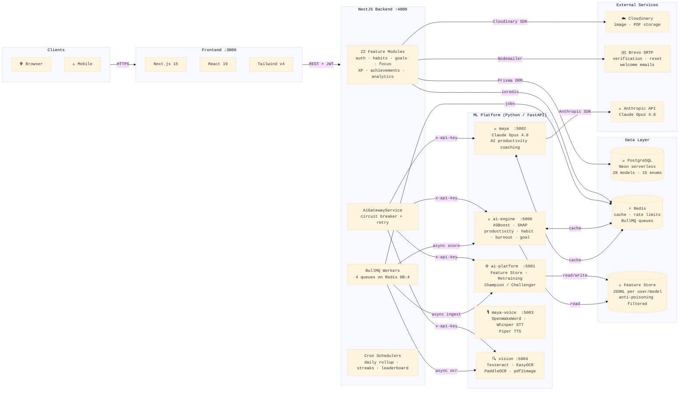
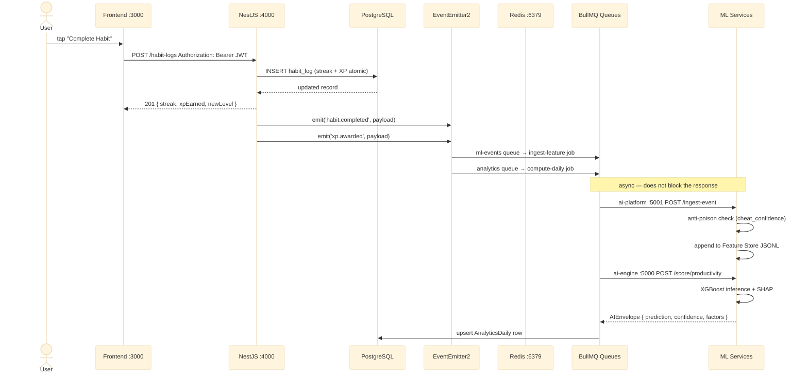
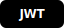

# Ascend

> A SaaS productivity platform. Build habits, crush goals, track your growth one day at a time.

---

## What is Ascend?

Most people who want to improve their lives juggle five different apps — one for habits, one for tasks, one for goals, a timer for focus sessions, and a notes app to track what actually happened. Nothing connects. Progress is invisible. Motivation fades.

Ascend brings all of that into one place and makes it actually rewarding to show up every day.

You set goals with milestones and attach motivation images — the grade screenshot, the target physique, the savings number. You build habits that feed directly into those goals and log completions to keep streaks alive. You run timed focus sessions that reward you with XP. Your work compounds into a level, a skill tree, achievements, and a leaderboard.

The platform runs an AI suggestion engine (Maya) that reads your data — missed habits, overdue tasks, social media overuse — and sends you a tailored action plan each day instead of generic advice.

### The problem it solves

| Common struggle | How Ascend addresses it |
| --- | --- |
| Habits break without visible streaks | Heatmap calendar, streak count, XP for every log |
| Goals feel abstract and distant | Milestone progress bars, motivation image uploads, auto-complete at 100% |
| Context-switching kills deep work | Built-in Pomodoro / Deep Work / Ultra Focus timer with session history |
| No feedback on whether effort is consistent | Weekly and monthly analytics with charts, daily snapshots |
| Accountability without a coach | Commitment tracker — declare a goal publicly, stake XP on it |
| Social media eating productive time | Social tracker logs daily platform usage and feeds into Maya's suggestions |
| Motivation is personal and visual | Upload your own motivation images tied to specific goals |

### Benefits

- **Single dashboard** — habits, tasks, focus, goals, analytics, and your rank in one view.
- **Gamified progress** — XP, levels, skill trees, rarity-tiered achievements, and weekly leaderboards make consistency intrinsically rewarding.
- **Data that talks back** — Maya reads your logs daily and produces specific, personalized suggestions rather than generic wellness tips.
- **Built for real goals** — attach grade screenshots, weight targets, savings goals, or any motivation image to a goal and see it every time you check progress.
- **Full accountability loop** — declare a commitment, stake XP, mark it done or fail it.

---

## System Architecture



---

## Request & Event Flow



---

## Monorepo Structure

```
ascend/
├── backend/
│   ├── src/                 # NestJS application
│   │   ├── modules/         # 22 feature modules
│   │   ├── integrations/
│   │   │   ├── email/       # Brevo SMTP
│   │   │   └── ai-gateway/  # AiGatewayService (circuit breaker + retry)
│   │   ├── queues/          # BullMQ processors + event listeners
│   │   └── jobs/            # Cron schedulers
│   ├── ml/
│   │   ├── ai/              # XGBoost inference engine  :5000
│   │   ├── ai-platform/     # MLOps platform            :5001
│   │   ├── maya/            # Claude coaching           :5002
│   │   ├── maya-voice/      # Voice interface           :5003
│   │   └── vision/          # OCR pipeline              :5004
│   └── prisma/              # Schema (28 models) + migrations
├── frontend/                # Next.js 15 web app        :3000
├── pnpm-workspace.yaml
└── turbo.json
```

| Package | Description | Port |
| --- | --- | --- |
| `backend` | NestJS API — auth, habits, goals, gamification, analytics | `4000` |
| `frontend` | Next.js 15 — dashboard, onboarding, all UI | `3000` |
| `backend/ml/ai` | XGBoost inference — productivity, habit, burnout, goal | `5000` |
| `backend/ml/ai-platform` | MLOps — feature store, retraining, champion/challenger | `5001` |
| `backend/ml/maya` | Claude Opus 4.8 coaching engine | `5002` |
| `backend/ml/maya-voice` | Voice interface — Whisper STT, Piper TTS | `5003` |
| `backend/ml/vision` | OCR pipeline — Tesseract, EasyOCR, PaddleOCR | `5004` |

---

## Stack

| Layer | | |
| --- | --- | --- |
| **API** |    | NestJS 11 · TypeScript 5 · Node.js 20 |
| **Database** |    | PostgreSQL · Prisma v6 · Neon serverless |
| **Auth** |   | JWT rotation · OAuth2 · TOTP 2FA |
| **Files & Email** |   | Cloudinary uploads · Brevo SMTP |
| **Docs** |  | Swagger / OpenAPI at `/api/docs` |
| **Frontend** |    | Next.js 15 · React 19 · Tailwind v4 |
| **ML** | | XGBoost · SHAP · Claude Opus 4.8 · Faster Whisper · Piper TTS |

---

## Prerequisites

| Requirement | Version |
| --- | --- |
| Node.js | ≥ 20.0.0 |
| pnpm | ≥ 10.0.0 |
| Python | ≥ 3.11 |
| Redis | ≥ 7.0 |
| PostgreSQL | Neon account or local instance |

---

## Root Scripts

| Command | Description |
| --- | --- |
| `pnpm dev` | Start backend + frontend concurrently |
| `pnpm build` | Build all packages |
| `pnpm lint` | Lint all packages |
| `pnpm type-check` | TypeScript check across all packages |
| `pnpm db:migrate` | Run Prisma migrations |
| `pnpm db:seed` | Seed database with skills, achievements, challenges |
| `pnpm db:studio` | Open Prisma Studio |
