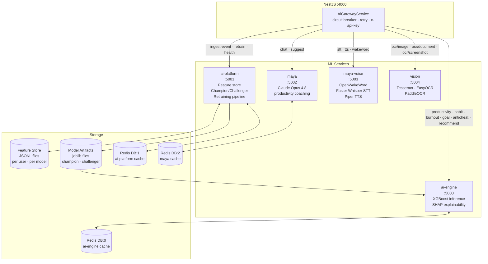
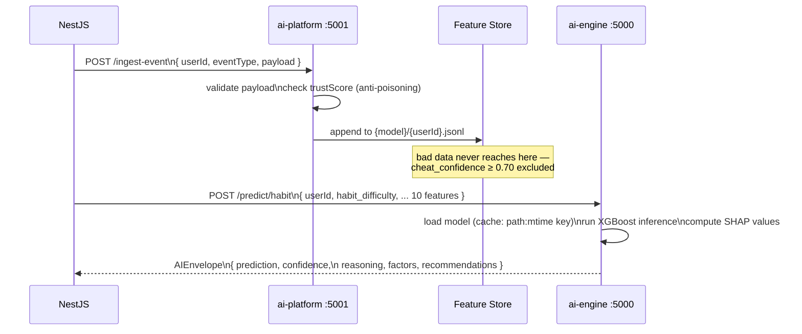
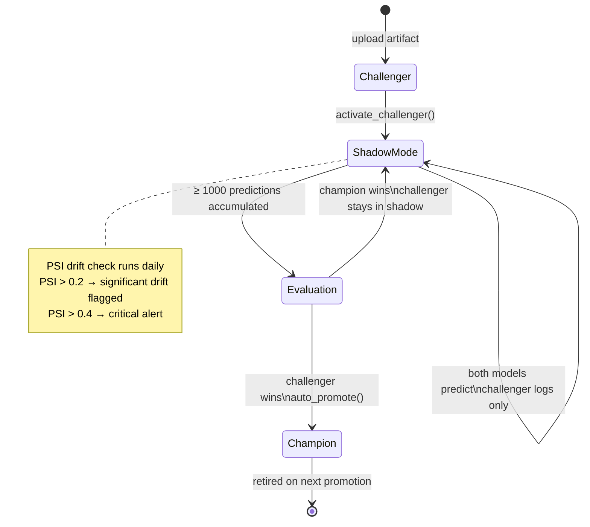
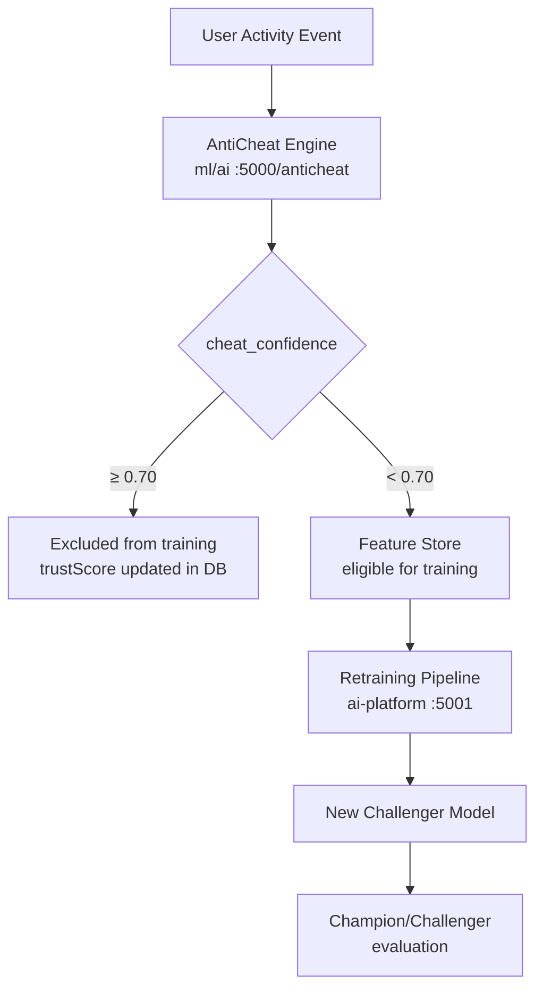

# Ascend ML Platform

Five FastAPI services that power the AI layer of Ascend. All are read-only with respect to the PostgreSQL database — NestJS is the sole DB writer.

---

## Service Map



---

## Data Flow — Feature Ingestion to Prediction



---

## Model Lifecycle — Champion/Challenger



---

## Anti-Poisoning Pipeline



---

## Security Model

| Concern | Mitigation |
| --- | --- |
| Inter-service auth | `x-api-key` header required on every route; 401 on missing/wrong key |
| Rate limiting | Redis sliding-window per `x-user-id` / client IP (fallback to in-process) |
| Path traversal | `_safe_user_id()` regex + `os.path.abspath` containment check on Feature Store writes |
| Model poisoning | Users with `cheat_confidence ≥ 0.70` excluded from all training data |
| Sensitive data leakage | `str(exc)` never returned to callers — structured error object only |
| DB writes | None — all services are read-only; NestJS is the sole DB writer |
| Image retention | Temporary files only; deleted immediately after OCR processing |

---

## Ports & Redis DB Assignments

| Service | Port | Redis DB | Notes |
| --- | --- | --- | --- |
| ai-engine | 5000 | 0 | Inference cache, rate-limit keys |
| ai-platform | 5001 | 1 | Platform cache |
| maya | 5002 | 2 | Coaching response cache |
| maya-voice | 5003 | 3 | Voice session state |
| vision | 5004 | — | No caching (image data too large) |
| NestJS queues | — | 4 | BullMQ job queues |

---

## Performance Targets

| Endpoint | Target | Implementation |
| --- | --- | --- |
| AI inference (habit/productivity/burnout/goal) | < 200ms | In-process model cache keyed `path:mtime`, 300s TTL |
| Maya coaching response | < 500ms | Redis cache on full request SHA-256 hash |
| OCR processing | < 1.5s | EasyOCR GPU when available; Tesseract CPU fallback |
| Recommendation generation | < 300ms | Cached at Redis with 60s TTL |
| Dashboard load | < 500ms | Pre-computed `UserDashboardSnapshot`, refreshed every 5 min |

---

## Running the Services

```bash
# Create a shared virtualenv (or use per-service envs)
python -m venv .venv && source .venv/bin/activate

# Install shared deps
pip install -r requirements/base.txt

# Start each service (separate terminals)
cd ai         && uvicorn app:app --port 5000 --reload
cd ai-platform && uvicorn app:app --port 5001 --reload
cd maya        && uvicorn app:app --port 5002 --reload
cd maya-voice  && uvicorn app:app --port 5003 --reload
cd vision      && uvicorn app:app --port 5004 --reload
```

All services read `ML_API_KEY` from the environment. Set the same value in NestJS `.env`.
