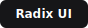
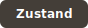

# Ascend — Frontend

> Next.js 15 web application for the Ascend productivity platform. Built with React 19, Tailwind CSS v4, and a full Radix UI component system.

---

## Tech Stack

| | Category | Technology | Notes |
| --- | --- | --- | --- |
|  | **Framework** | Next.js 15 | App Router, server + client components |
|  | **Language** | TypeScript 5.8 | Strict mode |
|  | **UI Library** | React 19 | Concurrent features, `use()` hook |
|  | **Styling** | Tailwind CSS v4 | JIT, PostCSS, CSS variables |
|  | **Components** | Radix UI | 15 headless primitives — Dialog, Dropdown, Toast, Slider |
|  | **Animations** | Framer Motion 12 | Page transitions, micro-interactions |
| | **Icons** | Lucide React | 500+ consistent SVG icons |
|  | **Global State** | Zustand 5 | Lightweight store |
|  | **Server State** | TanStack Query v5 | Caching, background refetch, optimistic updates |
|  | **Forms** | React Hook Form 7 + Zod | Schema validation, type-safe |
| | **HTTP Client** | Axios | Interceptors for silent token refresh |
| | **Charts** | Recharts 2 | Analytics dashboards, habit heatmaps |
| | **Drag & Drop** | @hello-pangea/dnd | Kanban tasks, habit reordering |
| | **Dates** | dayjs | Lightweight, same API as moment |
| | **Themes** | next-themes | Dark / light / system |
| | **Toasts** | Sonner | Notification system |
| | **Typography** | Geist (Vercel) | Clean, modern sans-serif |
|  | **Testing** | Playwright | End-to-end browser tests |

---

## Pages

| Route | Description |
| --- | --- |
| `/` | Landing page |
| `/auth/login` | Email login + Google / GitHub OAuth |
| `/auth/register` | Sign up |
| `/auth/verify-email` | Email verification |
| `/auth/forgot-password` | Password reset request |
| `/auth/reset-password` | New password form |
| `/dashboard` | Overview — XP, streaks, habits today, active goals |
| `/habits` | Habit list, log completions, heatmap calendar |
| `/planner` | Task board — drag-and-drop, date range view |
| `/goals` | Goal cards, milestone progress, motivation images |
| `/focus` | Focus session timer — Pomodoro / Deep Work / Ultra Focus |
| `/analytics` | Daily / weekly / monthly performance charts |
| `/leaderboard` | XP rankings, streak board, my rank |
| `/achievements` | Achievement gallery with rarity tiers |
| `/skills` | Skill tree with XP progress bars |
| `/social-tracker` | Daily social media usage log |
| `/accountability` | Commitment tracker with XP stakes |
| `/profile` | User profile, avatar upload, preferences |
| `/settings` | Notifications, theme, productivity preferences |

---

## Project Structure

```
frontend/
├── src/
│   ├── app/                    # Next.js App Router
│   │   ├── layout.tsx          # Root layout — fonts, theme providers
│   │   ├── globals.css         # Tailwind base + CSS custom properties
│   │   ├── (auth)/             # Auth route group
│   │   └── (app)/              # Authenticated app route group
│   ├── components/
│   │   ├── common/             # Button, Input, Modal, Card, Badge, Avatar…
│   │   ├── layout/             # Sidebar, Navbar, Header
│   │   ├── home/               # Landing page sections
│   │   ├── dashboard/          # Dashboard widgets
│   │   ├── habits/             # Habit cards, heatmap
│   │   ├── goals/              # Goal cards, progress ring
│   │   ├── focus/              # Session timer
│   │   └── analytics/          # Chart components
│   ├── lib/
│   │   ├── api/                # Axios instance + typed API service functions
│   │   ├── hooks/              # Custom React hooks
│   │   └── utils/              # cn(), formatters, date helpers
│   ├── store/                  # Zustand stores
│   └── types/                  # TypeScript types and API response shapes
├── tailwind.config.ts
├── postcss.config.mjs
└── next.config.ts
```

---

## Commands

| Command | Description |
| --- | --- |
| `pnpm dev` | Start dev server on port **3000** — hot reload |
| `pnpm build` | Production build |
| `pnpm start` | Start production server |
| `pnpm lint` | ESLint check |
| `pnpm type-check` | TypeScript check without emit |
| `pnpm test` | Playwright end-to-end tests |
| `pnpm test:ui` | Playwright with interactive UI mode |

### Start the dev server

```bash
cd frontend
pnpm dev
```

App runs at: **`http://localhost:3000`**

---

## Environment Variables

| Variable | Description | Example |
| --- | --- | --- |
| `NEXT_PUBLIC_API_URL` | Backend API base URL | `http://localhost:4000/api/v1` |
| `NEXT_PUBLIC_APP_URL` | Frontend app URL | `http://localhost:3000` |
